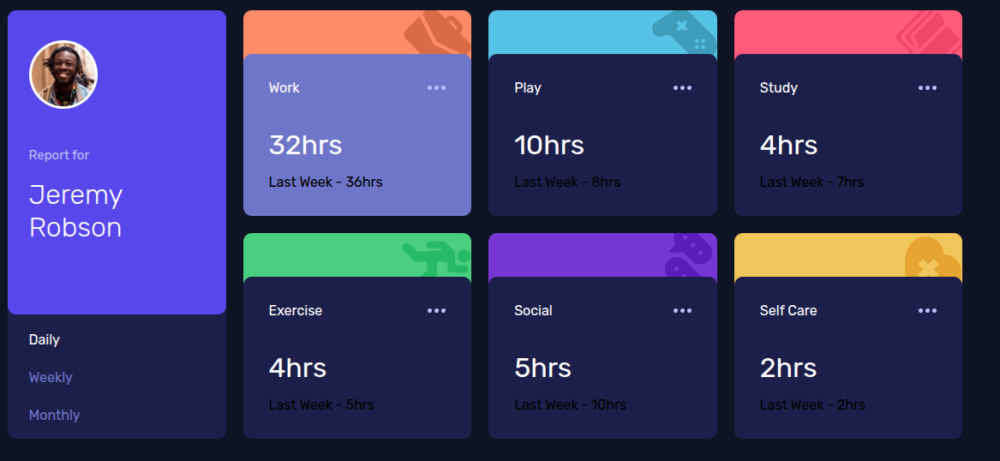

# Time-tracking-dashboard
This is a frontend project that can be used to track daily activities

# technologies
- html
- css
# screenshots


# 
## Installation

Install my-project with npm

```bash
  npm install my-project
  cd my-project
```

## Run Locally

Clone the project

```bash
  git clone (https://github.com/Njuguna-Peter-njoroge/Time-tracking-dashboard.git)
```
# developments
include javascript and typescript for more interactivity
# related
github ("https://github.com/Njuguna-Peter-njoroge/News-homepage.git")